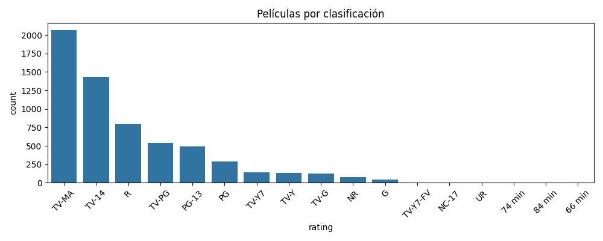
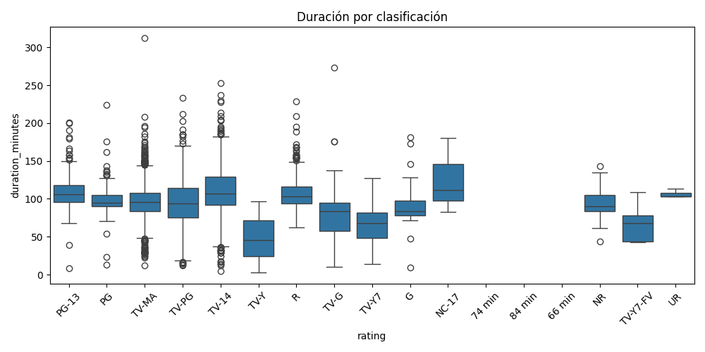
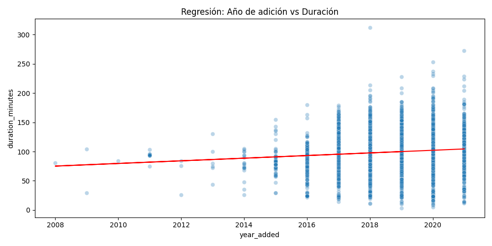

# Proyecto 3: Visualización de Datos y Análisis Estadístico

## Objetivo

Visualizar relaciones entre variables del catálogo de películas de Netflix y aplicar análisis estadísticos como ANOVA y regresión.

## Dataset

[Netflix Movies](https://www.kaggle.com/datasets/shivamb/netflix-shows) 

DatasetFiltrado para incluir solo películas (type = Movie)

## Herramientas utilizadas

Python (Pandas, Seaborn, Matplotlib, Scikit-learn, Statsmodels)

Power BI

## Análisis estadístico

ANOVA: duración media por clasificación

Regresión lineal: duración vs año de adición

## Visualizaciones realizadas

Películas agregadas por año

Distribución de duración por clasificación

Tendencia de duración con el tiempo

Dashboard interactivo en Power BI

## Graficos

